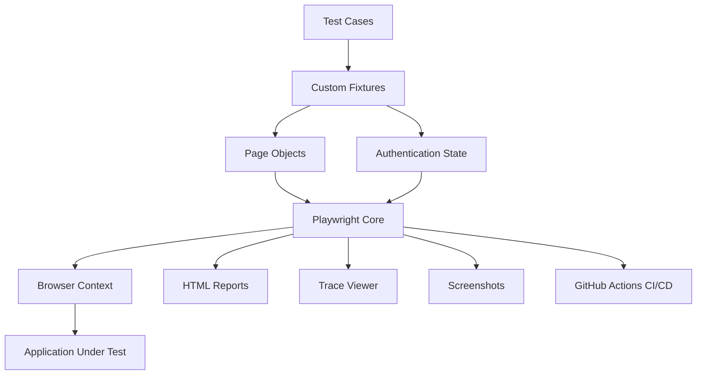
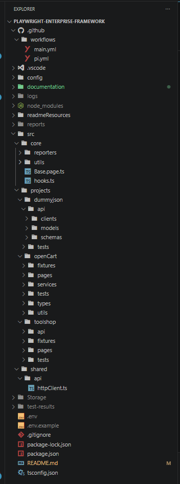
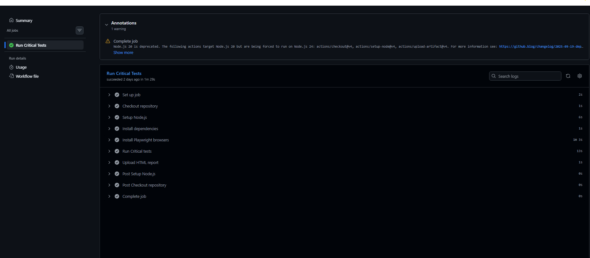
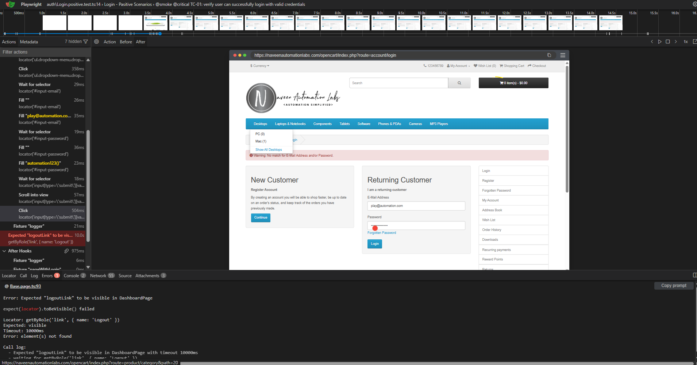

# Enterprise Playwright Automation Framework (UI + API Testing)


A scalable and maintainable test automation framework built with Playwright and TypeScript for modern web applications.

Designed using patterns commonly found in production automation frameworks, including custom fixtures, authentication state reuse, multi-project architecture, parallel execution, custom reporting, and CI/CD integration.

The framework separates shared infrastructure from application-specific test logic, making it easier to scale automation efforts across multiple applications and teams.

---

## Highlights

- Enterprise-grade Playwright + TypeScript framework
- Multi-project architecture
- Custom fixtures and dependency injection
- Authentication state reuse
- Pipeline-aware execution strategy
- Parallel execution support
- GitHub Actions CI/CD integration
- Custom enterprise reporting
- Scalable and maintainable framework design
- Environment-based configuration management
- HTML reports, screenshots, traces, and execution logs

---

## Why This Framework Exists

Many automation projects begin as small test suites but become difficult to maintain as applications, teams, and environments grow.

This framework was designed to address common enterprise automation challenges:

- Reusable and scalable architecture
- Separation of framework and business logic
- Fast execution through authentication state reuse
- Parallel execution support
- CI/CD integration readiness
- Long-term maintainability
- Environment-aware execution strategies
- Improved reporting and debugging capabilities

---

## Architecture Overview



Simplified representation given below:

```text
Tests
   ↓
Custom Fixtures
   ↓
Page Objects
   ↓
Core Utilities & Configuration
   ↓
Application Under Test
```

---

## Key Features

| Capability              | Implementation                             |
| ----------------------- | ------------------------------------------ |
| Language                | TypeScript                                 |
| Automation Tool         | Playwright                                 |
| Framework Design        | Multi-Project Architecture                 |
| Test Design Pattern     | Page Object Model (POM)                    |
| Dependency Management   | Custom Fixtures                            |
| Authentication Handling | Storage State Reuse                        |
| Environment Management  | .env Configuration                         |
| Parallel Execution      | Playwright Workers                         |
| Reporting               | Playwright HTML Reports                    |
| Debugging               | Trace Viewer                               |
| Failure Evidence        | Screenshots                                |
| CI/CD Integration       | GitHub Actions                             |
| Scalability             | Shared Core + Project-Specific Modules     |
| Maintainability         | Separation of Framework and Business Logic |

---

## Advanced Capabilities

### Authentication

- Worker-scoped authentication
- Persistent session reuse
- Storage state management
- Faster execution through session persistence

### Reporting

- Custom enterprise reporter
- Worker execution logs
- Aggregated execution metrics
- JUnit reports
- HTML reports
- CI/CD reporting support

### Parallel Execution

- Worker-isolated execution
- Dedicated authentication state per worker
- Parallel execution optimization
- Configurable worker allocation

---

## Custom Enterprise Reporter

The framework includes a custom Playwright reporter that aggregates execution information, worker activity, execution metrics, and test results to provide enhanced visibility during local and CI/CD executions.

Benefits include:

- Enhanced execution visibility
- Aggregated test metrics
- Worker-level execution insights
- CI/CD-friendly reporting
- Improved troubleshooting support

---

## Pipeline-Aware Execution

The framework supports environment-aware execution strategies commonly used in enterprise CI/CD pipelines.

| Pipeline | Purpose                   |
| -------- | ------------------------- |
| PR       | Fast smoke validation     |
| Main     | Critical test execution   |
| Nightly  | Full regression execution |

Based on pipeline context, the framework dynamically adjusts:

- Test scope
- Retry strategy
- Worker allocation
- Parallel execution settings

Example:

```bash
PIPELINE=pr
PIPELINE=main
PIPELINE=nightly
```

This approach enables fast feedback during pull requests while supporting broader validation for main branch and nightly executions.

---

## Technology Stack

| Technology     | Purpose                |
| -------------- | ---------------------- |
| Playwright     | UI Automation          |
| TypeScript     | Test Development       |
| Node.js        | Runtime Environment    |
| GitHub Actions | CI/CD                  |
| HTML Reports   | Test Reporting         |
| Trace Viewer   | Debugging              |
| dotenv         | Environment Management |

---

## Engineering Challenges Solved

### Authentication Reuse

Repeated UI logins increase execution time and introduce unnecessary instability into automated test suites.

To address this, the framework uses Playwright Storage State management, allowing authenticated sessions to be reused across test executions. This reduces execution time and improves overall test reliability.

### Framework Scalability

As automation projects grow, framework code and business-specific test code often become tightly coupled.

To prevent this, the framework separates shared infrastructure from application-specific implementations through a multi-project architecture. This enables multiple applications to coexist within the same framework while keeping responsibilities clearly defined.

### Maintainability

Large automation projects can quickly become difficult to maintain when setup logic is duplicated across tests.

The framework uses custom fixtures to centralize setup, dependency injection, and reusable test components. This reduces duplication and improves long-term maintainability.

### Parallel Execution

Execution time becomes a significant challenge as test suites expand.

The framework is designed to support Playwright's parallel execution capabilities, enabling faster feedback cycles and improved CI/CD efficiency.

### Failure Analysis

Investigating test failures can be time-consuming when limited debugging information is available.

To improve troubleshooting, the framework provides multiple debugging layers including:

- HTML Reports
- Playwright Trace Viewer
- Screenshots
- Execution Logs

These artifacts help identify root causes more efficiently during local and CI/CD executions.

---

## Project Structure

```text
.github/
└── workflows/

.vscode/

config/

docs/

src/
├── core/
├── shared/
│   └── api/
└── projects/
    ├── dummyjson/
    ├── openCart/
    └── toolshop/

Storage/
└── auth-state.json

Root
├── .env
├── .env.example
├── package.json
└── package-lock.json
```

---

## Quick Start

### Prerequisites

Before running the framework, ensure the following are installed:

- Node.js (LTS Version)
- npm
- Git

### Clone the Repository

```bash
git clone https://github.com/Asifkhanmkd/playwright-enterprise-framework.git
cd playwright-enterprise-framework
```

### Install Dependencies

```bash
npm install
```

### Install Playwright Browsers

```bash
npx playwright install
```

### Execute All Tests

```bash
npm test
```

### Open the HTML Report

```bash
npm show-report
```

---

## Repository Screenshots

The following screenshots provide visual evidence of framework execution, reporting, debugging capabilities, and CI/CD integration.

### Framework Structure



---

### Playwright HTML Report


---

### GitHub Actions Pipeline



---

### Trace

Playwright Trace Viewer provides step-by-step execution playback, allowing failed test scenarios to be investigated in detail.



---

## CI/CD Integration

The framework is designed to support automated execution through GitHub Actions.

Current CI/CD capabilities include:

- Automated test execution
- Pipeline-aware execution strategy
- Smoke test validation
- Critical test validation
- Report generation
- Artifact publishing
- Playwright Trace Viewer support

### Typical Workflow

1. Checkout Repository
2. Install Dependencies
3. Install Playwright Browsers
4. Execute Test Suite
5. Generate Reports
6. Publish Artifacts
7. Review Results

The framework architecture has been designed to support continuous testing practices and integration into modern DevOps pipelines.

---

## Reports & Debugging

The framework provides multiple layers of execution visibility and failure analysis.

### HTML Reports

Provides execution summaries, pass/fail statistics, execution duration, and detailed test results.

### Trace Viewer

Supports step-by-step execution playback for investigating failed test scenarios.

### Screenshots

Failure screenshots can be captured to assist with root cause analysis.

### Logs

Execution logs help diagnose environment, framework, and application issues during local and CI/CD runs.

---

## Author

**Muhammad Asif**

Software QA Engineer specializing in:

- Playwright
- TypeScript
- Selenium
- Test Automation Framework Design
- CI/CD Integration

---

This repository demonstrates modern Playwright automation engineering practices with a focus on scalability, maintainability, reliability, and enterprise-ready CI/CD integration.
